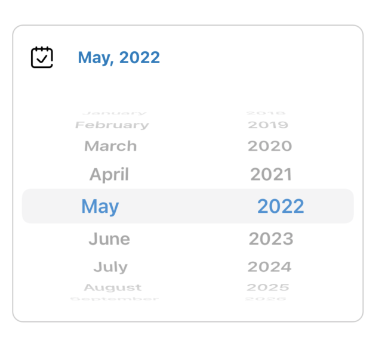

<p align="center"></p>

[](https://travis-ci.org/HazarathReddy/TimpsCalendar)
[](https://cocoapods.org/pods/TimpsCalendar)
[](https://cocoapods.org/pods/TimpsCalendar)
[](https://cocoapods.org/pods/TimpsCalendar)


TimpsCalendar helps you to pick the date from calendar. This library constains of two different types of calendars(normal, quick). You can chooose based on your requirment. It's designed based on iOS standards.


## Requirements

- iOS 9.0+, iPadOS 9.0+
- Swift 5.0+


## Installation

TimpsCalendar is available through [CocoaPods](https://cocoapods.org). To install
it, simply add the following line to your Podfile:

```ruby
pod 'TimpsCalendar'
```


## Calendar type - Normal

Set calendar type as normal to get this design 

<p align="center"></p>
<p align="center"></p>

```swift
    calendar.calendarType = .normal
 ```
 
## Calendar type - Quick

Using quick type you can easily change the month and year with single swipe. Set calendar type as quick to get this design 

<p align="center"></p>

```swift
    calendar.calendarType = .quick
 ```

## Using interface builder

Add calendar to view by using interface builder

<p align="center"></p>

## Using code

Use below code to add calendar to your view

```swift
    let timpsCalendar = TimpsCalendar(frame: calendar.bounds)
    timpsCalendar.calendarType = .normal
    timpsCalendar.delegate = self
    self.calendar.addSubview(timpsCalendar)
 ```
 
 
 Use delegate method to get selected date 
 
 ```swift
    extension ViewController: TimpsCalendarDelegate {
    func selectedDate(date: Date) {
        debugPrint("Selected date: \(date)")
     }
   }
 ```

## Example

To run the example project, clone the repo, and run `pod install` from the Example directory first.

## Author

https://github.com/HazarathReddy

## License

TimpsCalendar is available under the MIT license. See the LICENSE file for more info.
